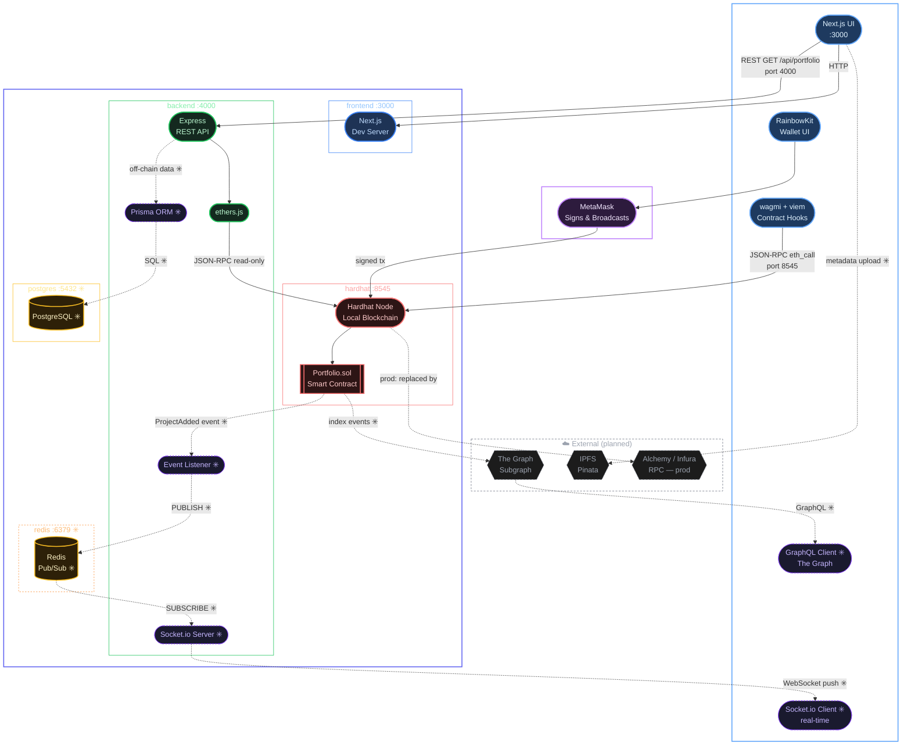
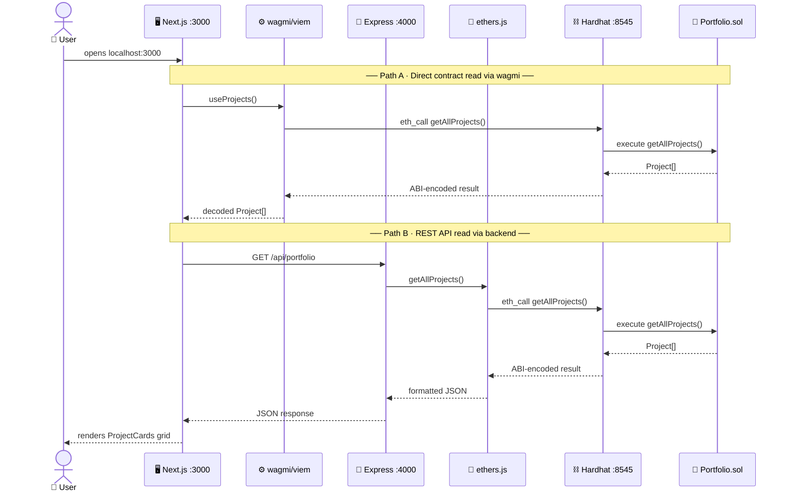
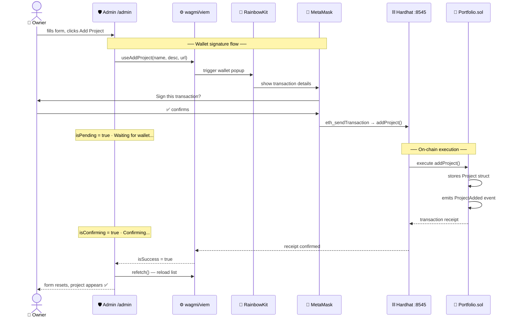
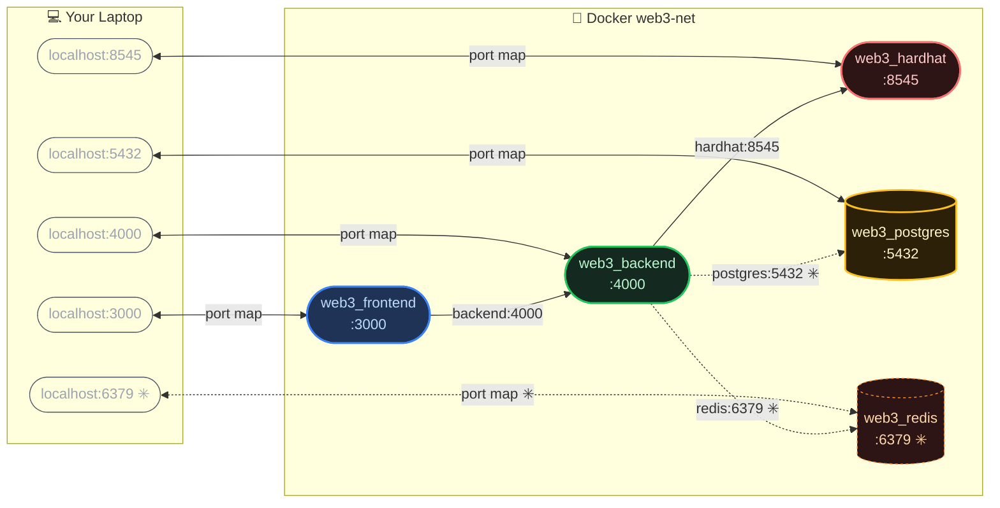
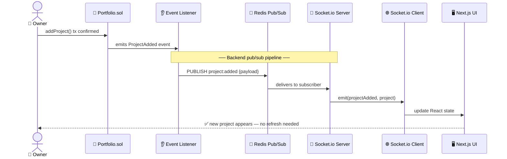
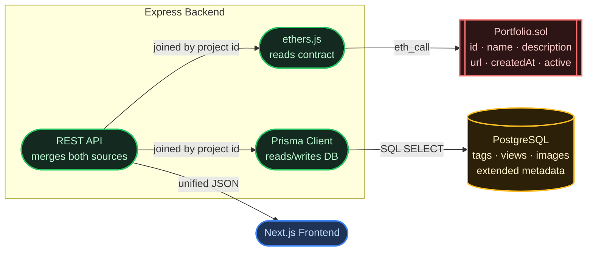
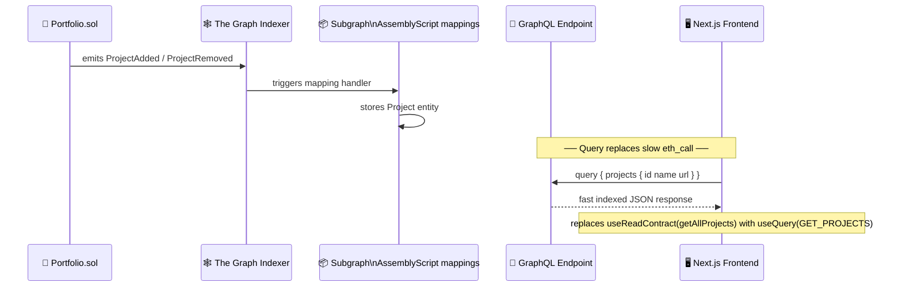
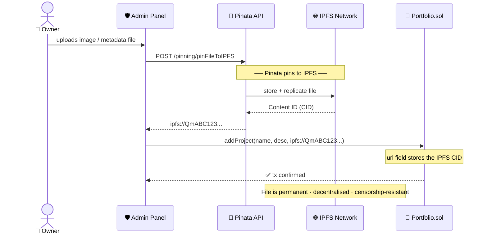
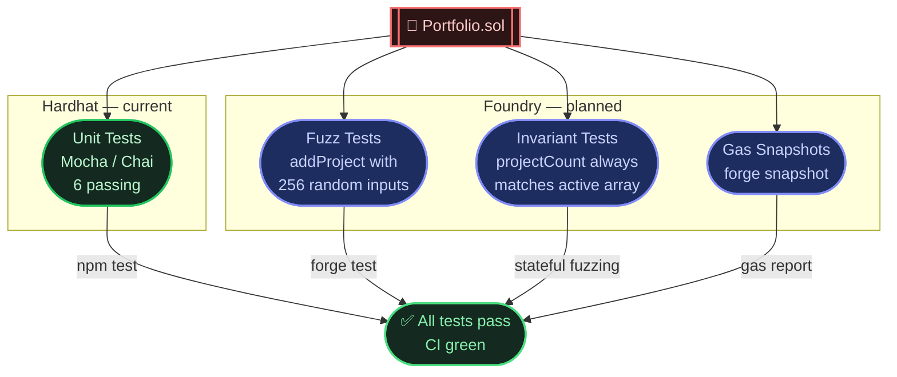
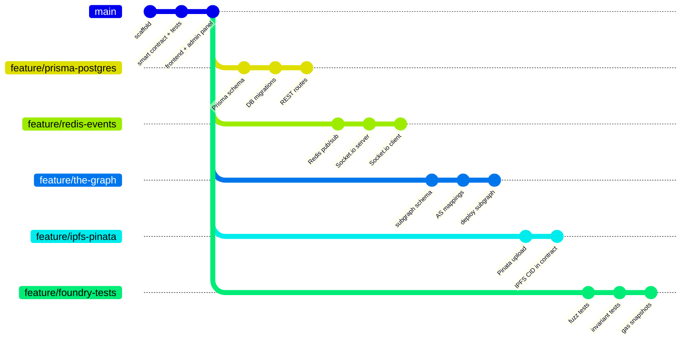

# Architecture Diagram

Full system architecture — all services, communication paths, and data flows.

> Rendered automatically by Obsidian. Switch to **Reading View** (Ctrl+E) if you see raw code.

---

## Full Stack Overview

# Architecture Diagram

Full system architecture — all services, communication paths, and data flows.

> Rendered automatically by Obsidian. Switch to **Reading View** (Ctrl+E) if you see raw code.
> 
> **Legend:** Solid arrows = currently working &nbsp;|&nbsp; Dashed arrows = planned feature branch

---

## Full Stack Overview

---

## Data Flow — Reading Projects (Public Page)

---

## Data Flow — Adding a Project (Admin Panel)

---

## Docker Internal Network

---

## Planned Feature Flows

---

### ✳️ Real-Time Events — Redis + Socket.io

---

### ✳️ Off-Chain Metadata — Prisma + PostgreSQL

---

### ✳️ Blockchain Indexing — The Graph

---

### ✳️ Decentralised Storage — IPFS + Pinata

---

### ✳️ Advanced Testing — Foundry

---

## Feature Branch Roadmap

---

## Notes

| Symbol | Meaning |
|---|---|
| Solid arrow `-->` | Currently implemented and working |
| Dashed arrow `-.->` | Planned — not yet built |
| ✳️ | Planned feature |
| `[[ ]]` shape | Smart contract |
| `[( )]` shape | Database / persistent store |
| `{{ }}` shape | External service |
| `([ ])` shape | Application service / API |
